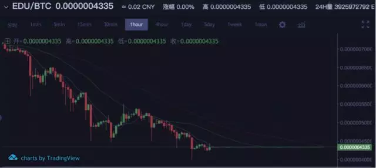
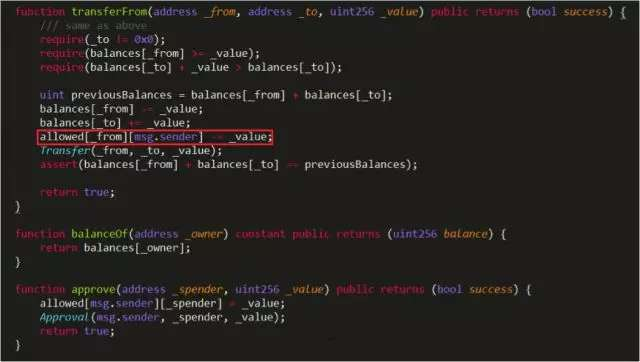

5月23日晚间，火币pro官方发表公告，暂停EDU充提币业务，并同时暂停EDU/BTC和EDU/ETH的交易。

 EduCoin是建立在区块链和智能合约技术基础上，面向在线教育内容分享和服务的去中心化教育平台，而EDU是基于以太坊ERC-20协议发行的项目代币，总量150亿。在火币发布暂停EDU公告之前，EDU在火币上的交易K线就已出现了大量抛售的现象。从5月20日午夜开始，大量EDU被人抛售，而持续的抛售带来的则是市场的进一步恐慌，EDU的价格持续走低，直到5月23日火币关停交易，期间累计售出的EDU超过20亿。

 

随后，有安全团队爆出，EDU被大量抛售的原因，是因为项目方地址被黑客恶意攻击，从中盗走超过30亿EDU，而黑客之所以非常容易的窃取了代币，正是因为EDU的智能合约，有着一个非常大的漏洞。

 

在ERC-20代币规范中，approve功能函数用于指定某个用户(_spender)可以使用自己账户(msg.sender)多少代币的操作权限，transferFrom( )函数用于实现用户（_from）向另外一个用户(_to)转账一定数量（_value）EDU代币的功能。但是，EDU代币合约在进行transferFrom功能函数代码设计的时候，并没有检查调用者（msg.sender）所转账的数量是否超过了最大授权的可操作值（allowed[_from][msg.sender]），而是直接进行如下转账操作：

allowed[_from][msg.sender] -= _value; 

 

因此，任何人都可以直接调用transferFrom函数，无限制的将任意账户的EDU代币转账到指定的账户（_to）,从而导致任何持有EDU代币的账户都可被盗取，造成用户财产损失。而此次的EDU被盗事件正是因此发生。

 

这已不是区块链市场第一次发生如此重大的数字货币被盗事件，去年7月，Parity钱包出现安全漏洞，被黑客盗取15万ETH；今年1月，日本大型数字货币交易所Coincheck系统被黑，时价5.3亿美金的新经币被盗；还有DAO事件、BEC事件、SMT事件和最近的EDU事件，每一次数字货币的大量被盗都对整个数字货币市场行情带来了巨大的影响。

 

而这些事件的背后，往往是由于充当区块链技术最核心的程序—“智能合约”出现了问题。由于区块链开发者的经验欠缺，开发工作缺乏统一的标准和规划，且项目方为了快速发币而忽略安全等因素，智能合约的漏洞往往都存在或多或少的问题。**据不完全统计，仅市面上公开的智能合约，就有多达38000多个安全漏洞。**如何快速有效的发现漏洞，成为了区块链智能合约开发工作中的难题。

 

专注于区块链安全的成都链安科技有限公司，历时近两年时间的研究与开发，**率先研制出了全球第一个高度自动化的区块链智能合约形式化验证平台VaaS（Verification as a Service）**，其验证效率高、自动化程度高、人工参与度低、易于使用、支持多个合约开发语言、可支持大容量区块链底层平台等特点，恰恰能解决智能合约安全漏洞的问题。**5月21日铅笔网已经对VaaS的“一键式”自动化功能率先进行了报道**

**(http://chainb.com/?P=Cont&id=9183)**，小编下面接着阐述如何利用VaaS的一键验证功能查找EDU合约漏洞。

电脑端请复制地址观看：

https://v.qq.com/x/page/f0667iy4y4y.html

在链安科技形式化验证VaaS平台中，导入待验证的智能合约源代码。输入待验证的合约名称，点击“常规漏洞检查”按钮，即可一键自动化的检查出合约存在的溢出等常规安全漏洞，生成错误报告提示，并精确定位到合约漏洞代码的所在位置。

 

链安科技的智能合约形式化验证（Formal Verification），可将智能合约转化数学模型，通过逻辑上的推理来验证模型，从而证明智能合约的安全性。**而VaaS又是全球第一个高度自动化的形式化验证平台**，通过极少的人工参与，开发者便可迅速发现合约漏洞，从而进行修复，可极大地避免由于安全漏洞带来的财产损失。

 

此外，成都链安科技针对今年的热门区块链项目EOS平台，已经研制出了全球第一个支持EOS合约的全自动化的形式化验证平台，为即将上线的EOS提前做好安全预防，其一键式验证效果如下：

 

电脑端请复制地址观看：

https://v.qq.com/x/page/k0667v9l0zj.html

 