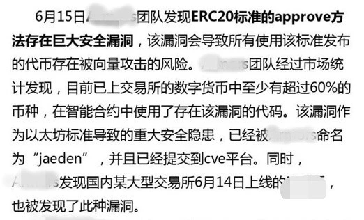
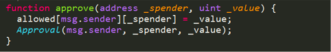
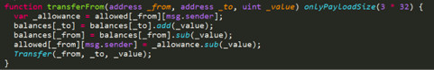
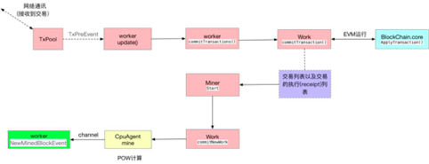

近期，有人发现并报道了ERC20标准的approve方法存在巨大安全漏洞，并声称**该漏洞会导致所有使用该标准发布的代币存在被向量攻击的风险**。

该团队经过市场统计发现，目前已上交易所的数字货币中至少有超过60%的币种，在智能合约中使用了存在该漏洞的代码。

**该漏洞作为以太坊标准导致的重大安全隐患，已经被该团队命名为“jaeden**”，并且已经提交到cve平台。

有人发布ERC20存在巨大安全漏洞

**紧接着，慢雾科技、Hashgard等团队对此给予明确的回复**：**均认为是虚惊一场**。

成都链安科技一直都非常重视智能合约安全问题，**鉴于行业对该“重大漏洞”的分歧，为了使广大智能合约开发者，以及区块链从业者能够更多的了解该问题，我们也专门针对此问题进行了深入分析和探讨**，并且给出我们的解决办法，便于大家写出更安全的智能合约。

**到底什么是「****jaeden漏洞」？**

**首先，**我们来看看approve函数是如何使用的：

从代码中我们可以看到：**以太坊ERC20代币标准，可以用approve函数来授权第三方账户使用指定额度的代币**。然后，第三方账户便可以通过使用transferfrom函数来使用授权给自己账户的代币。

**那么，****approve函数为什么就可能会造成一定安全隐患呢**？因为在区块链交易过程中，对于间隔时间很短的交易，用户广播消息gas的数量不同，会直接影响交易打包到区块的先后顺序，gas多的消息会被优先执行。区块链交易过程图如下：

 

**举个简单的例子**：用户A使用approve授权给用户B使用100代币额度，后来用户A要改变授权额度为50代币。在更改授权之前，用户A查询用户B是否使用了授权额度的代币，如果查询到B并没有使用之前的额度，则通过approve函数重新授权给用户B新的50代币的额度。

以上过程仅为用户A的操作，于此同时，用户B同样可以进行相关操作：

用户A查询用户B授权的使用情况，确定用户B没有使用授权代币后，用户A发出更改授权额度交易，但在更改交易成功之前，**用户**B**可利用区块链打包消息的机制，发起一个**gas**数量很大的从用户**A**转账**100**代币的交易**。

由于用户B发出的交易gas数量大于用户A更改授权额度交易的gas数量，因此矿机先执行用户B的交易，于是用户B将抢先在用户A更改授权额度交易生效之前转走了用户A上次授权的100代币。从而，**等到矿机执行了修改50额度的交易后，用户B又可以使用新授权的50代币**。

所以，用户A、B上述授权和转账的操作过程将可能产生两种结果：

1. 用户A成功的实现了授权额度的更新，用户B只能使用用户A授权的50代币；
2. 用户B得到两次次授权，可以使用150代币。

**因此，用户在使用****approve****重新授权过程中可能导致两种不同的执行结果，存在造成多次授权的可能性。**

**如何规避****「jaeden漏洞」？**

那么，既然存在多次授权的隐患，那么有没有规避的办法呢？

答案是：有的，我们针对此问题，给出下面两种规避的方法。 

**第一，在更改授权之前，可先通过approve函数设置授权代币数量为0**。等到授权为0操作成功后，并查询被授权的用户没有使用过原授权代币，再通过approve函数重新设置授权代币数量，就可以避免多次授权。

**第二，建议代币智能合约开发使用increaseApproval和decreaseApproval函数，进行授权更改操作**。该功能直接在授权代币数目上面做增减操作，以避免上述问题。

 

**不算漏洞的漏洞**

经过上文的分析，我们认为，**将此问题归结为安全的“重大漏洞”有点夸大，其本质是区块链交易过程的排队机制会造成插队现象**，从而引起了操作结果的不唯一性。

在用户本身不做多次授权更改的情况下，是不会造成相关问题的。另外，即使用户需要做多次授权，也有技术方法规避该类情况的发生。

 此外，我们对于最近有人报道的关于铸币函数Mint的高危漏洞问题，也进行了分析，我们认为mint函数不一定导致恶意增发。我们对以太坊市值Top 500的代币合约进行了审计，发现有107个合约使用的mint函数，可使代币发起方实现代币的无限增发。

我们将此情况与交易所进行了及时反馈，通过跟项目方和交易所的沟通发现，**并不是所有的铸币函数都是高危漏洞**，**有的合约使用该函数是因为代币发起方项目必不可少的功能需求**。当然，也不排除有的项目方会利用该函数恶意增发的可能。