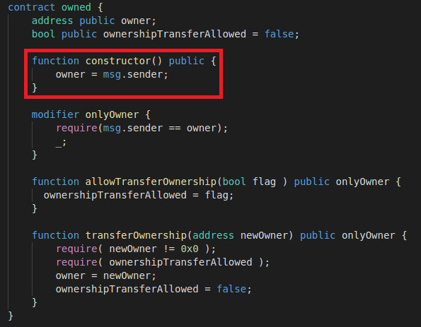
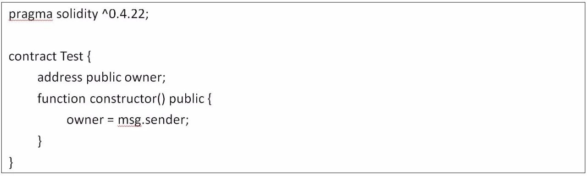
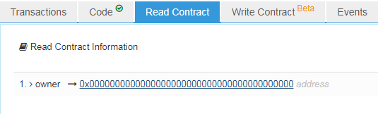
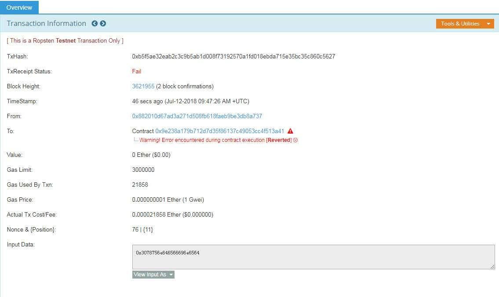
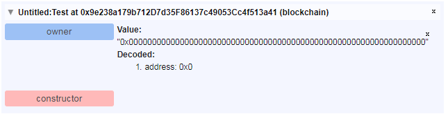
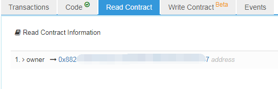
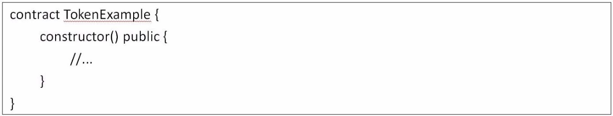

Solidity 0.4.22版本更新引入了一种**新的构造函数声明形式:constructor() public {}**，通过这种写法，可以避免在合约开发过程中误将构造函数名写错，使得其变为普通函数，并且任何人都可以调用这个函数。

但是，近期成都链安科技使用 VaaS平台在分析区块链上智能合约的时候，发现有**开发者对constructor函数的使用存在问题**：

经过VaaS平台的自动化工具检测，准确定位到了错误代码的位置，并高亮显示。而在验证结果中，该错误的类别为 “name"（命名问题），具体内容是避免使用 ”function constructor()“ 的函数形式。

经过我们的分析得出，新的构造函数一方面给合约开发者带来了便利，但如果合约开发者使用不当会存在一定的隐患，严重时甚至会导致交易所Token被盗，给交易所及Token持有者带来利益上的损害，针对这样的问题，链安科技针对constructor函数使用漏洞进行了进一步分析，并给出了解决办法。

**新型函数使用不当分析**

首先，链安科技对合约开发者错误使用构造函数进行了具体的分析：

owned合约的constructor()函数，即构造函数，将合约创建者地址赋予owner，用于后续的身份验证。但是合约的构造函数声明存在错误，将constructor() 误写成了 function constructor()，进而产生了安全问题。

注：msg.sender 为当前操作账户地址、owner为合约管理者地址

由于 function constructor()不是构造函数的声明形式，这里相当于声明了一个函数名为constructor的普通函数，可被执行多次；而constructor函数的可见性修饰符为public，可被其他账户地址调用并修改owner的值，盗用合约管理权限。

以下通过Ropsten测试链对该问题进行验证：

使用remix编译部署测试合约Test，地址0x9e238a179b712D7d35F86137c49053Cc4f513a41，

合约代码如下：

可以看到，刚部署合约后合约的owner为0地址，因为并没有构造函数对其进行赋值：

现在使用Remix调用constructor函数，发现交易失败，分析后发现data字段不是constructor的函数签名（0x3078756e646566696e6564）：

更换另一个版本的solidity编译器http://dapps.oraclize.it/browser-solidity：

执行constructor函数，发现owner被更改，说明该漏洞存在：

**对该漏洞进行分析，其可能导致的后果如下：**

1、合约可被普通用户窃取owner权限；

2、目前很多ERC20代币合约部署的时候将所有代币发放到owner账户中，如果出现此漏洞，可导致用户无限增发代币。

**如何避免将会导致的风险**

既然合约开发者可能会存在使用constructor函数不当，那么作为项目方应该如何去防范后期可能造成的风险呢？**我们给出下面两种建议方法**：

1、新的constructor使用方法为，前面无function声明：

2、Remix-ide等编译器会对constructor的错误使用产生警告，开发者千万不要忽略编译器告警，推荐更改源码，消除所有编译器警告。

**项目方及开发者应引起足够重视**

总而言之对项目方而言，开发者书写合约敏感函数（如构造函数、回调函数）时，应严格遵循官方命名要求，并重视编译器提出的警告。同时，合约在发布到主链前，开发者应在官方提供的测试网络上进行充分验证。

最后，链安科技提醒各项目方及合约开发者一定要遵守智能合约安全开发的规范，引入安全审计流程，必要的时候采用形式化验证手段，从多角度分析合约代码，找出那些容易忽略的问题，并且做到防患于未然。