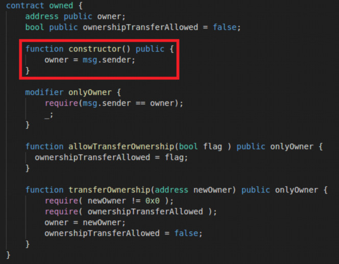
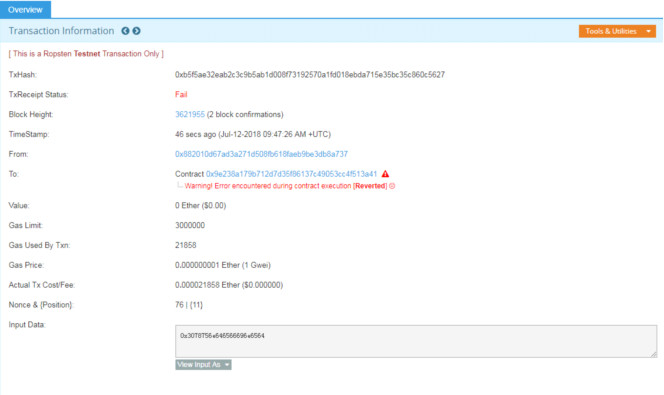
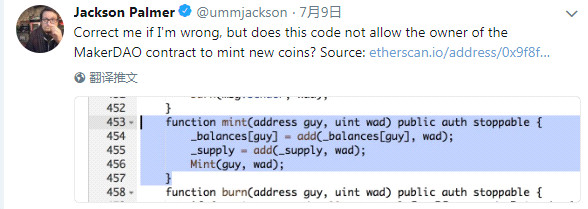

7月12日，成都链安科技（LianAn Technology）智能合约审计小组使用自主研发的VaaS平台对以太坊链上智能合约进行安全审计的过程中，发现了3份合约存在新的安全漏洞。**此漏洞是合约构造函数constructor()使用不当从而导致Owner权限被盗。**

**问题描述**

 

以太坊solidity0.4.22引入了新的构造函数声明形式constructor()，该函数引入的目的是避免编程人员在编写构造函数时的命名错误 （如6月22日，MorphToken事件中“Owned”被写成“owned”，没有注意大小写，使owned函数成为一个普通函数，导致任何账户都能调用它，更改owner变量，转移合约所有权）。

 

然而，由于用户编写函数时习惯性的使用function进行声明，从而导致构造函数constructor的使用引入新的漏洞。

 

正确的构造函数形式：constructor()  public {    }

错误的构造函数形式：function constructor()  public {    }

 

成都链安科技使用 VaaS平台对以太坊区块链上智能合约进行了分析，发现如下3份智能合约存在constructor函数使用不当导致Owner权限被盗的问题。

 

3份合约地址如下，请项目方自查，或与我们取得联系：

▲合约部分地址

 

通过VaaS平台的自动化工具检测，准确定位到了错误代码的位置，并高亮显示。

 

 

**问题分析：敏感函数使用不当**

 

链安科技安全审计团队发现，上述问题合约使用的Solidity编译器版本包含了0.4.15、0.4.23，而只有在Solidity0.4.22版本后，合约的constructor()函数才被视为构造函数的形式，并且直到下一版本才会对function constructor()的形式给出警告（注意：这里仅仅是警告，不是错误）。如果是使用Solidity0.4.23之前的版本，编译器把function constructor()作为普通函数进行编译，认为是正确的普通函数。

 

链安科技智能合约安全审计团队对存在该问题的合约进行了深入分析，由于该函数不符合构造函数形式，所以以太坊平台将把constructor函数作为普通函数供任何用户进行调用。进一步， owned合约的function constructor()函数的功能是将创建者地址赋予给owner，用于后续的身份验证。因此，任意账户地址都可以调用constructor()函数，并修改owner的值，导致合约管理权限被盗用。

注：msg.sender 为当前操作账户地址、owner为合约管理者地址

 

 

**漏洞验证**

 

安全审计小组将问题合约在Ropsten测试链上对该问题进行了进一步验证，发现：

 

1.由于缺少构造函数，初始化 owner值为0：

2.使用remix调用constructor函数，发现交易失败，分析后发现data字段不是constructor的函数签名：

 

3.更换另一个版本的solidity编译器，执行constructor函数，发现owner被更改，说明该漏洞存在：

 

**Owner****权限过大存在的安全隐患**

 

Owner是Solidity语言中对智能合约开发者的称呼，owner的能力犹如集齐6颗无限宝石的灭霸，属于超级权限。对前100基于以太坊ERC20协议智能合约（例如Bancor、Augur、MakerDAO、KyberNetwork、EnigmaMPC的智能合约）安全事件进行分析后，超级权限被盗可存在如下安全隐患：

 

•随时冻结代币转账

 

•任意铸造发行新的代币

 

•销毁任意账户内的代币

 

•额外增发代币

 

•停止整套交易系统运行

 

Owner权限如此之大，说明众多“去中心化”的产品，实际上暗藏一个一击必杀按钮，掌握在开发者的手上，所有对代币虎视眈眈的黑客或者内部人员都会想方设法夺取这个按钮的控制权。

 

▲Dogecoin创始人Jackson Palmer的推特评论

 

如此强大的权限一旦被黑客窃取，相当于从灭霸手上抢到了无限拳套，黑客可以对依赖智能合约交易的代币为所欲为，无论是冻结，增发，还是自毁，只需要调用合约中一个函数就可轻松实现，进而操纵整个代币的价值。而与之相关的代币也必将遭受冲击，后果不堪设想。

 

 

**如何避免将会导致的风险**

 

既然合约开发者可能会存在使用constructor函数不当，那么作为项目方应该如何去防范后期可能造成的风险呢？我们给出下面两种建议方法：

 

1.新的constructor使用方法为，前面无function声明：

2.Remix-ide等编译器会对constructor的错误使用产生警告，开发者千万不要忽略编译器告警，推荐更改源码，消除所有编译器警告。

​              

​                   

**问题总结**

 

链安科技团队整合审计小组的验证结果以及各区块链安全专家的意见后指出该漏洞导致的后果可能有：

 

1.合约可被普通用户窃取owner权限； 

 

2.目前很多ERC20代币部署的时候将所有代币发放到owner账户中，如果出现此漏洞，可导致用户无限增发代币；

 

以及更多取决于owner权限的严重后果（也许就像灭霸打一个响指，代币灰飞烟灭？）。

 

此次owner权限漏洞虽然来源于代码编写上的低级错误，但更多的是引起开发者对owner权限问题的反思，过于神化的owner权限必然导致owner权限漏洞成为众矢之的，而低级错误导致的此类漏洞是绝不应该出现的。

 

 

**项目方及开发者应引起足够重视**

 

因此，链安科技团队强烈呼吁广大开发者在合约编写上遵守开发规范，并且在写合约敏感函数（如构造函数、回调函数）时，应严格遵循官方命名要求，同时千万不要忽略编译器告警，在合约发布到主链之前，应在官方提供的测试网站上进行充分验证。必要的时候采用形式化验证手段，从多角度分析合约代码，找出那些容易忽略的问题，并且做到防患于未然。

 

同时，项目方在合约编写完成后，应当寻求有质量保证的智能合约安全审计团队进行合约安全审查，保证合约的安全性和功能准确性，防患于未然。