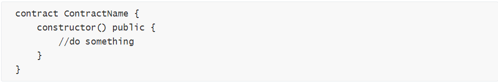
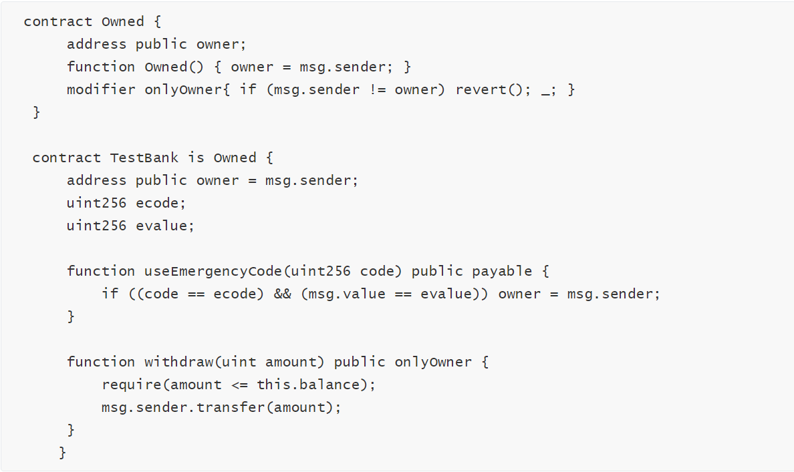

针对区块链安全问题，成都链安科技团队每一周都将出智能合约安全漏洞解析连载，希望能帮助程序员写出更加安全牢固的合约，防患于未然。

引子： 《易》曰：‘君子慎始，差若毫厘，缪以千里。’ - 《礼记·经解》

**前情提要**

上回书，机制依赖参数主导，矿工操纵投机取巧。

区块参数作为区块属性的数据，对于挖掘区块的矿工来说，并不具有完全的随机性，因此将其作为随机数生成的依据是有局限性和危险性的。

而以太坊本身又没有提供类似于传统语言的rand()函数，所以随机数生成的来源尽量来源于区块链外部或者利用新的信任模型RanDAO来完成。随机数生成作为目前以太坊游戏的核心，在原理的定制上直接决定了项目质量和项目寿命。

**本期话题**

继承变量名同实不同，构造函数名异失其义。

广义的名字，指明了一个特定的人或物，将其与相似的其他人或物区别开来。我们把名字作为对一个人或物的称呼，初次了解人或物，我们都会先尝试记住他们的名字。

计算机也是如此，在区块链开发，合约的编写当中，我们给予不同函数、不同变量以不同的名字，程序才能按照编写的意愿调用和执行。

正确书写名称、正确声明函数自然就成为智能合约安全开发的基础。然而，这样的问题在区块链发展到近期依然屡次出现，导致安全事件的发生，例如Morphtoken, B2X, DoubleOrNothinglmpl等多个合约中出现的Owned合约构造函数Owned大小写问题。

我们在连载开启之前的一篇文章（[**注意！3份合约又存在Owner权限被盗问题**](http://mp.weixin.qq.com/s?__biz=MzU2NzUxMTM0Nw==&mid=2247484096&idx=1&sn=d7f228bf24af9e66a6db6129b9e49aeb&chksm=fc9d529ccbeadb8a635bf46f46a23467fdee54eac862de982c7c9053ce0e2418a36ff8b003c4&scene=21#wechat_redirect)）中着重讲过这个问题。本期我们再次全面的概括由于名称书写，声明语句，继承中变量覆盖等细节问题引起的巨大安全隐患。

​                                     

**基础知识**

**Solidity中的构造函数**

Solidity的使用与面向对象编程语言非常相似。构造函数（constructor）用于初始化合约对象。一个合约的构造函数的方法名与合约的名字相同，在合约创建时，对于状态变量的数据初始化操作是通过调用构造函数完成的，一般包括：设置代币名称、标识符、发币、将所有代币发送给owner，注意此调用仅存在于合约部署时。

此外，合约的所有者（owner）的设置一般也放在构造函数当中。因此，构造函数相当于合约启动的引擎。

以太坊solidity0.4.22引入了新的构造函数声明形式constructor()，该函数引入的目的是避免编程人员在编写构造函数时的命名错误。

**Solidity中的继承**

Solidity支持多继承和多态，其原理是代码拷贝。换句话说，继承的写法总是能够写成一个单独的合约。当一个合约从多个合约继承时，只有一个合约（子类）会被部署到链上，而其他的代码都会被拷贝到这个单一的合约当中去。

**因小失大**

MorphToken出现的安全漏洞只是因为在构造函数中Owned大小写没有注意，Owned写成的owned，使owned函数失去构造函数仅在部署时才能调用的特殊性，导致任何账户都能调用，来实现更改owner变量，转移合约所有权的恶性事件。

攻击者在初次刺探时可能以为要黑构造函数可能相当于打李逵，结果细看之后发现对方不过是个李鬼。

继承的情况有许多种，在合约继承中出现的漏洞是因为：子类重新定义的变量继承父类的函数，而且还取了同样的名字来方便理解，而其实调用父类函数并不会操作子类的这个变量。

开发者认为函数操作的是子合约的变量，没想到操作的父合约的变量。（更多的阅读请参阅：Solidity原理（一）：继承(Inheritance)。）这个失误还曾被当作蜜罐手段伪装成漏洞吸引想要改变合约权限、偷取合约内资金的玩家上钩。

**构造函数失配漏洞**

上面讲到如果构造函数在声明时出错，变成了一个普通函数，那么，合约将存在重大安全风险。我们构造函数失配的情况分为两大类：

**一、构造函数名和合约名不一致**

· 案例合约：

在这个合约中，ownerWallet和合约的函数名不一致，变成了普通的函数，导致用户可以执行此函数，变成合约的owner，然后取出合约地址下的Ether。

· 漏洞修复：

Solidity 0.4.22提出了构造函数的新的写法constructor() public {},如果可能，推荐这种写法，如果版本低于0.4.22，那么一定要着重检测构造函数的名称是否和合约名相同。

**二、constructor声明形式错误**

· 案例合约

其中，owned合约的function constructor()函数的功能是将创建者地址赋予owner，用于后续的身份验证。

但是，在使用constructor声明构造函数时，开发者错误的在其前面添加了一个function关键字，导致其变成一个名为constructor普通的函数。任意账户地址都可以调用constructor()函数，并修改owner的值，导致合约管理权限被盗用。

· 漏洞修复

Solidity 0.4.22 提出的新的构造函数的完整声明形式如下，注意：constructor前无function

**合约继承中的变量覆盖漏洞**

这里我们拿Owned合约做一个简单的例子：

调用useEmergencyCode函数，只会更改TestBank合约中的owner，并不会更改Owned中的owner，onlyOwner中的owner仍是合约的部署者地址。

换句话说，TestBank合约中的owner与Owned中的owner是不一样的两个变量。根据上面提到的Solidity原理的解释：对于EVM来说，每个Storage 变量都会有一个唯一标识的slot id。在这里，虽然都叫做owner，但是从bytecode的角度来看，他们都是由不同的slot id来确定的，因此也和变量的名字没有什么关系。

关于Storage变量以及slot的相关知识我们也曾在[**第七期存储器局部变量未初始化**](http://mp.weixin.qq.com/s?__biz=MzU2NzUxMTM0Nw==&mid=2247484711&idx=1&sn=a11a779e8333174c276addf4d6c97d35&chksm=fc9d557bcbeadc6d318ef873a856ad0f783a6d7c099b83ec490a5c6d3110580aed2f6ba43cd9&scene=21#wechat_redirect)中讲到过，在此就不赘述。

**失之毫厘，差之千里**

正确记住对方的名字，在社交礼仪中是非常重要的一点，代表着对他人的尊重。

在合约编写的过程中，规范书写，正确声明，辨析不同变量也是对代码的尊重，更是对工作的尊重。在做到这份尊重的同时，也能带来项目质量和资金安全的提升，当大部分开发者都做到这一点，这个产业的良性循环也就慢慢启动。

本回结语：蔺相如，司马相如，名相如，实不相如；魏无忌，长孙无忌，人无忌，尔勿无忌。

**引用：**

[1]: Solidity原理（一）：

继承(Inheritance)：

https://blog.csdn.net/Programmer_CJC/article/details/80042261 

[2]: 以太坊蜜罐智能合约分析：

https://paper.seebug.org/631/ 

[3]: Solidity语法---以太坊智能合约生命周期：

https://www.jianshu.com/p/61e2d9e31aab 

[4]: 深入理解Solidity：

https://solidity-cn.readthedocs.io/zh/develop/solidity-in-depth.html 

[5]: 注意！3份合约又存在Owner权限被盗问题——低级错误不容忽视：

https://mp.weixin.qq.com/s/xPwhanev-cjHhc104Wmpug 